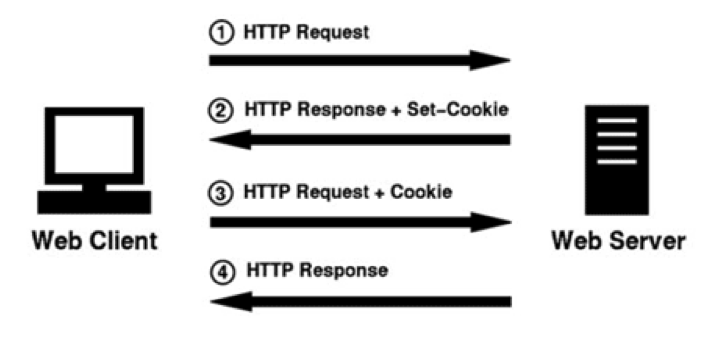

## Maintaining state in web applications
* In any realistic interactive Web application you will come across the need of retaining information between individual pages. This is referred to as "maintaining state" or as the "persistence of data". 
   * HTTP protocol does not support this, it is a stateless protocol - every page request starts in a blank state with no knowledge of data that was available on the previous page.
* There is an easy way to transfer data provided by the user in a HTML form to another page for processing like the hidden input filed in 'Modify cat' form in `index2.html`. But what if you need to send that data further to third page (common requirement e.g. in multi-page forms on that allow users to register or sign-up to a Web service)? Certainly you do not want to ask the user re-type some data, such as his/her username.
* Server-side programming languages provide several ways to do this
  * The hidden form element can be used for simple applications
  * Cookies
  * Session variables
 
## Cookies 
* A mechanism for storing data on the client computer
* The data saved in a cookie is available between separate visits to a web site
* Should not be used for permanent storage of data
  * e.g. user can access the web site from different computers, or cookies can be deleted from the browser menu. 
* Main drawback of cookies is that the user can turn them off in the client
* But cookies can be handy e.g. for storing:
   * user's preferences on the site's visual preferences, such as background color, font. 
   * session keys to provide for user identification and login to e.g. e-commerce site 
   * Note that in express you need to use a third party modules which provide [cookie](https://expressjs.com/en/resources/middleware/cookie-parser.html) and [session](https://expressjs.com/en/resources/middleware/session.html) mechanisms
   
### Cookie implementation
* Different clients implement the cookies in their specific ways, but the following are the general features that you will find in any of them:
* Cookies store variables name and value, plus additional information such as expiration time and the name of web site where the cookie came form. 
* By default web site can modify only it's own cookies 
* Cookies are sent between server and client as part of the HTTP header
   * This means that they must be sent before any HTML code.

### Cookie transactions
* A typical application of cookies consists of two transactions (four HTTP messages)
   * Client sends an HTTP request 
   * Server sends an HTTP response including the Set-Cookie header 
   * Client sends an HTTP request with the cookie in the header
   * Server sends an HTTP response
   

### Setting cookies
* [res.cookie](https://expressjs.com/en/api.html#res.cookie)
* [cookie parser](https://expressjs.com/en/resources/middleware/cookie-parser.html)
* [example](https://www.tutorialspoint.com/expressjs/expressjs_cookies.htm)

## Session management
* Sessions provide another way to preserve data across subsequent accesses to a web site
* Using the session mechanism, a visitor accessing your web site is assigned an unique id, the so-called session id. 
* The session functions allows you to register variables to be preserved across requests
* When a visitor accesses your site, PHP will check whether a specific session id has been sent with the request. If so, the prior saved environment with the registered variables is recreated.
* The session id is either stored in a cookie on the client computer, or is propagated from a call to another as part of the URL 
* Starting and resuming a session: [req.session](https://expressjs.com/en/resources/middleware/session.html#reqsession)
* [express-session](https://expressjs.com/en/resources/middleware/session.html)
* [example](https://www.tutorialspoint.com/expressjs/expressjs_sessions.htm)
  
## [Web Storage API](https://developer.mozilla.org/en-US/docs/Web/API/Web_Storage_API)
* alternative to cookies
* useful for storing app state in client side in e.g. hybrid apps programmed with React Native or Ionic etc.

